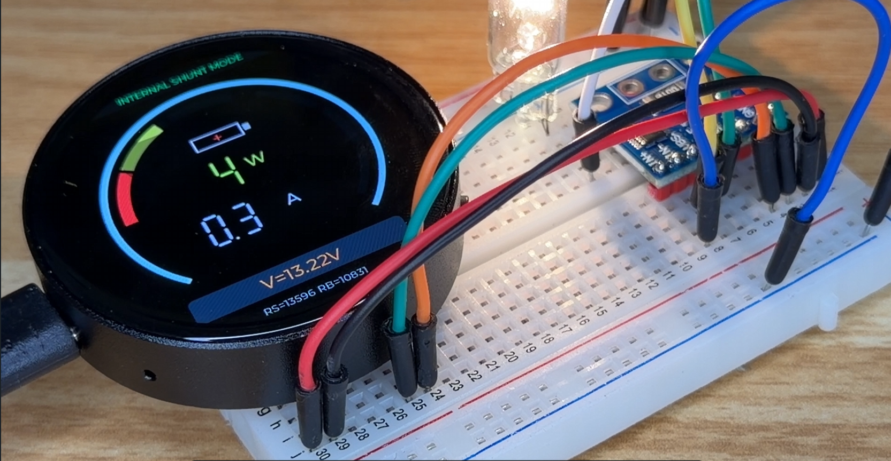

# T5-E1 Smart Power Monitor

Real-time High-Accuracy Power Monitor (INA226 + R100 Shunt)  
Tested on real 12V loads with live current, voltage, and power tracking.
## Why this project matters

Most INA226 projects online are incorrectly calibrated and give misleading results.

This project:
- Uses REAL R100 shunt (0.1Ω)
- Shows actual current limits (~0.8A safe range)
- Includes calibration for real 12V systems
- Tested with real loads, not simulation

This is not a demo — this is a real measurement tool.
## Real Test

Test conditions:
- Voltage: 12V
- Load: ~5W
- Measured current: ~0.3A

Live UI shows:
- Current (A)
- Power (W)
- Voltage (V)
- Overrange warning when approaching limit
- 
## Current Version (R100 Shunt)

This version is configured for INA226 module with onboard shunt:

- Shunt: R100 = 0.1Ω
- Voltage: 12V system
- Max safe current: ~0.8A
- Interface: I2C
- Display: AMOLED 1.75" (466x466)

## Hardware Used

- Tuya T5-E1 AMOLED board
- INA226 current sensor (R100 module)
- 12V power source

## Wiring

INA226 → T5-E1:

- SDA → GPIO17  
- SCL → GPIO16  
- VCC → 3.3V  
- GND → GND  

## Features

- Real-time voltage measurement
- Real-time current measurement
- Real-time power calculation
- Custom circular LVGL UI
- Overcurrent warning (0.8A limit)

## Build & Flash

```bash
cd C:\Users\maher\tuyaopen
.\export.bat
cd C:\Users\maher\tuyaopen\my_ina219_ui
python ..\tos.py clean
python ..\tos.py build
python ..\tos.py flash --port COM4
## Video Demonstration

## Video Demonstration

Full build and testing video:
https://youtube.com/@inventorkr1

More electronics projects:
- Power systems
- Batteries
- Inverters
- Real-world testing
